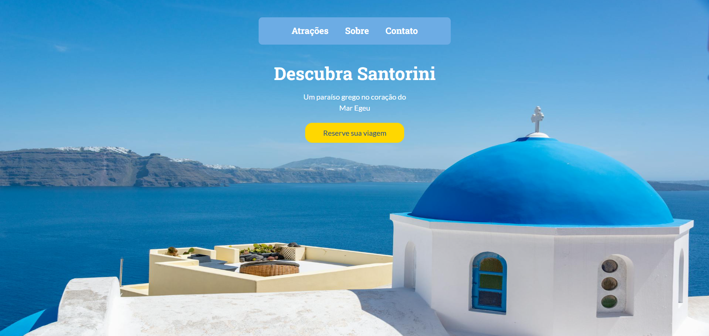

# 🏛️ Encantos de Santorini

**Landing page turística** dedicada a apresentar as belezas e encantos da ilha grega de **Santorini**. O projeto explora a arquitetura única, os pôr do sol famosos, os vinhos vulcânicos e as praias exóticas dessa ilha paradisíaca do Mar Egeu, com um visual clean.

## 📸 Preview

 

## 🚀 Demonstração

🔗 [Acesse o site](https://rochacode08.github.io/Santorini-Grecia/)

## 🛠️ Tecnologias utilizadas

- **HTML5** — estruturação semântica com `<header>`, `<main>`, `<section>`, `<footer>`, `<figure>`
- **CSS3** — estilização com **Flexbox**, **CSS Grid**, variáveis CSS e CSS nesting
- **Google Fonts** — tipografia com as fontes *Roboto Slab* (títulos) e *Lato* (texto)

## ✨ Funcionalidades

- ✅ Header com imagem de fundo em tela cheia (hero section)
- ✅ Menu de navegação com **scroll suave** (`scroll-behavior: smooth`)
- ✅ Galeria de atrações com cards em grid 2x2
- ✅ Cards com efeito de **gradiente sobreposto** às imagens
- ✅ Seção "Sobre Santorini" com layout em duas colunas
- ✅ **Totalmente responsivo** para tablets e celulares
- ✅ Arquitetura CSS **modular** organizada em arquivos separados
- ✅ Uso de **CSS Custom Properties** para temas e tipografia

## 🎨 Paleta de cores

Paleta inspirada nas cores características de Santorini:

| Cor                 | Hex       |
| ------------------- | --------- |
| 🔵 Deep Blue        | `#1A4B8C` |
| 🔷 Light Blue       | `#6CACE4` |
| 🟡 Sunset Yellow    | `#FFD700` |
| ⚪ White             | `#FFFFFF` |
| ⬜ Light Gray        | `#F0F0F0` |

## 📂 Estrutura do projeto

```
📦 encantos-santorini
 ┣ 📂 assets
 ┃ ┣ 🖼️ bg-header.jpg             → Imagem de fundo do header
 ┃ ┣ 🖼️ santorini-architecture.jpg
 ┃ ┣ 🖼️ sunset.jpg
 ┃ ┣ 🖼️ wine-volcano.jpg
 ┃ ┣ 🖼️ santorini-sea.jpg
 ┃ ┗ 🖼️ santorini-dusk.jpg
 ┣ 📂 css
 ┃ ┣ 📜 import.css       → Arquivo que importa todos os demais
 ┃ ┣ 📜 global.css       → Reset, variáveis e estilos globais
 ┃ ┣ 📜 utility.css      → Classes utilitárias (flex, grid, container)
 ┃ ┣ 📜 header.css       → Estilos do cabeçalho
 ┃ ┣ 📜 main.css         → Estilos da área principal (cards)
 ┃ ┣ 📜 section.css      → Estilos da seção "Sobre"
 ┃ ┣ 📜 footer.css       → Estilos do rodapé
 ┃ ┗ 📜 responsive.css   → Media queries para responsividade
 ┗ 📜 index.html          → Página principal
```

## 📱 Responsividade

O projeto conta com **3 breakpoints** principais:

| Dispositivo    | Largura máxima | Principais ajustes                        |
| -------------- | -------------- | ----------------------------------------- |
| 💻 Tablet      | até 1024px     | Margens e fontes reduzidas                |
| 📱 Tablet S    | até 768px      | Grid vira coluna única, seção empilhada   |
| 📱 Mobile      | até 480px      | Fontes menores e espaçamentos compactos   |

## 💻 Como rodar o projeto

Clone o repositório:

```bash
git clone https://github.com/rochacode08/Santorini-Grecia.git
```

Acesse a pasta do projeto:

```bash
cd Santorini-Grecia
```

Abra o arquivo `index.html` no navegador — ou utilize a extensão **Live Server** do VS Code para recarregamento automático.

## 📚 O que eu aprendi

Este projeto reforçou diversos conceitos importantes no meu aprendizado:

- Estruturação semântica com HTML5
- Uso combinado de **Flexbox** e **CSS Grid** para layouts complexos
- **CSS Custom Properties** para criar um *design system* consistente (tipografia e cores)
- Shorthand da propriedade `font` para definir tudo de uma vez
- Organização de CSS em **arquivos modulares** com `@import`
- **CSS Nesting** nativo (selectors aninhados sem pré-processador)
- Uso de pseudo-elementos `::before` com `inset` para criar overlays
- `scroll-behavior: smooth` para navegação suave entre seções
- Uso de âncoras (`#atracoes`, `#sobre`) para navegação interna
- Media queries e técnicas de responsividade
- Boas práticas de `background-image` com posicionamento

## 🔮 Melhorias futuras

- [ ] Adicionar animações de entrada (scroll reveal)
- [ ] Criar formulário de reserva funcional
- [ ] Implementar galeria de imagens com lightbox
- [ ] Adicionar mapa interativo da ilha
- [ ] Criar seção de depoimentos
- [ ] Implementar menu hamburguer no mobile
- [ ] Adicionar integração com previsão do tempo em Santorini

## 📝 Licença

Este projeto foi desenvolvido apenas para fins **educacionais e de estudo**.

---

## 👨‍💻 Autor
Desenvolvido com 💙 por **[Gabriel Rocha Lopes](https://github.com/rochacode08)**

<a href="mailto:gabrielrocha.devstack@gmail.com">
    
</a>
<a href="https://www.linkedin.com/in/gabriel-rocha-devstack">
    
</a>
<a href="https://www.instagram.com/gabriel_lopess15/">
    
</a>

---
